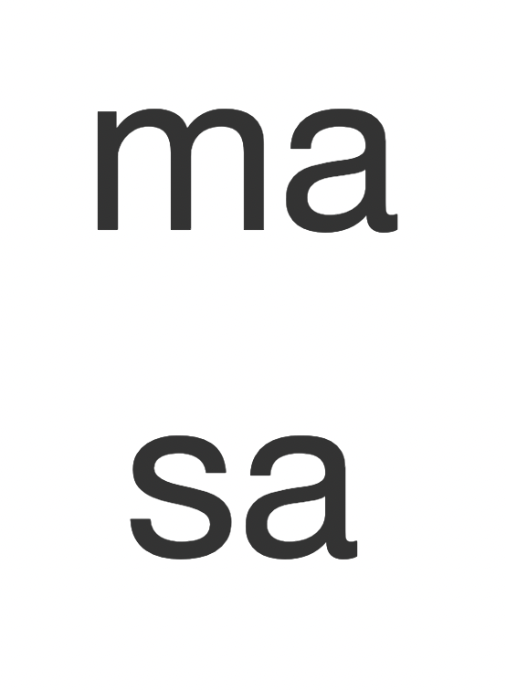
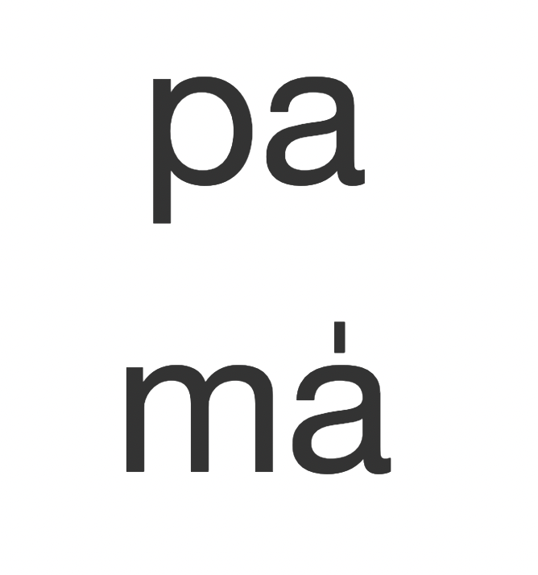
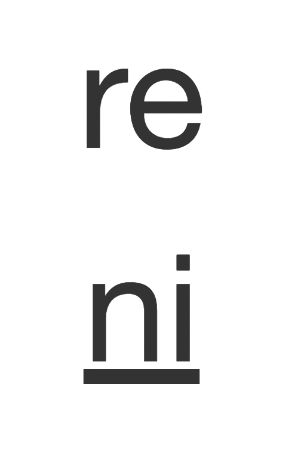
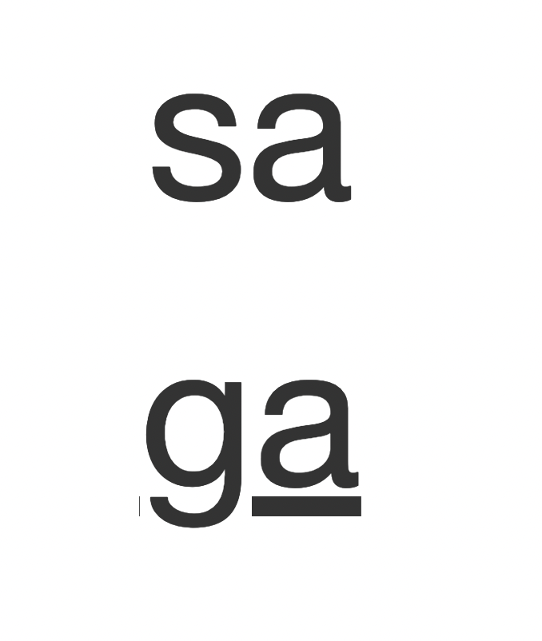

# swar-recognition

Web application which displays two random musical notes ('swar' in Hindi) in traditional 'sa-re-ga' notation (equiv. to do-re-mi). Used for ear-training and developing a proficiency for being able to sing any musical interval without assistance. Supports all 12 notes in the octave (includes accidentals).

Deployed via Heroku at [swar-recognition.herokuapp.com](https://swar-recognition.herokuapp.com/) until free plans are [shut down on November 28, 2022](https://blog.heroku.com/next-chapter).

## Images

On a click or page refresh, the two notes will randomize as below.

    
    
    
    

